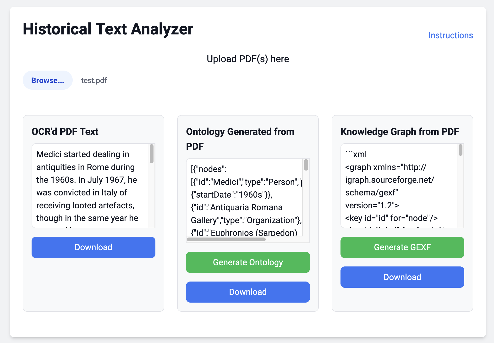
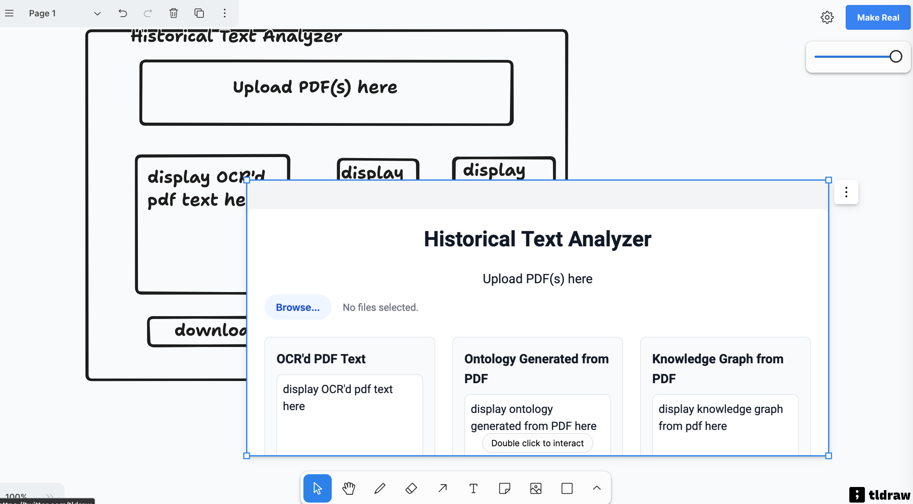

# text-to-kg
just an experiment inspired by [Maggie Appleton on 'Home Cooked Software'](https://maggieappleton.com/home-cooked-software). The UI html was generated from a sketch using [MakeReal](https://makereal.tldraw.com/) which is kinda nifty.



# How to use

You'll need:

+ [ollama](https://ollama.com/)
+ python
+ [homebrew](https://brew.sh/) (for poppler)
+ conda or miniconda to make an environment (there are other ways too)

First, you need to make an environment on your computer to get all the pieces you need in one spot. 

Assuming you have conda or miniconda installed:

```
$ conda create --name text-to-kg python=3.12 
$ conda activate text-to-kg
```
Then install into that environment:

```
$ brew install poppler
$ pip install flask paddlepaddle paddleocr pdf2image flask
$ pip install -U flask-cors
```

Then, run this thing:
```
$ python start_app.py
```

and go to [localhost:8000](https://localhost:8000)

If you want to use a different llm, use Ollama to grab whatever you want, then look in both the `app.py` and `index.html` files for all instances of `gemma:7b` and replace with your desired model.

# Diary

## sept 26

Memo to self - conda activate coref

added a start_app.py script to get the ollama, app, and web servers running.

updated to use the gemma model which works better.

## july 30

I've replumbed it to use paddleOCR which I've found gives really good results. However, to do this, I had to create a flask app. So, if you want to give this a whirl, there's a bit of set up you need to do.

It's a bit of a frankenstein's monster sort of thing, but that's what makes it fun. I'm working on a mac mini.

First, install some stuff:

```
$ brew install poppler
$ pip install flask paddlepaddle paddleocr pdf2image flask
$ pip install -U flask-cors
```

Then, in a terminal, start the app.py with `python app.py`. Open a new terminal window, and start the server with `python -m http.server`. Go to `localhost:8000` and you'll find the application! The 'app.py' program is running the python that handles the OCR using the PaddleOCR models; first time you run this, the models will download. Don't select a pdf to process until that part finishes (watch your terminal window). 

You can now give the webapp a pdf and it'll process it. For the next step, you need to have ollama running. Fire up Ollama on your machine, and then in _another_ terminal window, run `ollama run phi3:mini`. Once that's finished loading, you can hit the 'generate ontology' button, 'generate knowledge graph' button. If you want to use a different model, knock yourself out; there are two places in index.html where you'd specify the different model.

Fun, eh? Right now, the generated json/ontology works not too badly. Trying to find the right prompt for a graph csv. 


## july 29
uses tesseract.js to do ocr, then passes the text to a local model via ollama to try to generate an ontology; then uses that ontology to extract a knowledge graph. Best results with openai models, but it'd be better for a variety of reasons if it used a local model. tinyllama is absolute crap but it's what I used to develop since I'm currently working on a laptop without a lot of juice. You'll want to change that up. Also, it'd be better if something more powerful than tesseract.js was used for the ocr'ing.

download this repo; unzip.

open a terminal prompt in the folder. 

`python -m http.server` to serve the page up.

have ollama.ai downloaded.

use `ollama run {model name}` to install the best model you can use on your machine

modify the code in index.html to point to your model.

profit!


